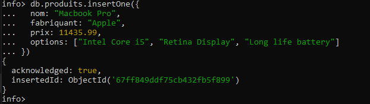

# MongoDB Project

Creating a NoSQL database : mongoDB

## Steps :

    - Installation
    - launching Mongo-server
    - launching Mongo-client
    - Creating_DB

### Installation :

    creating directory : C:\data\db

### Launching Mongo server :

    in command : .bin\monogd.exe

### Launching Mongo client :

    in command : mongo.exe

### Creating database :

    -in mongo.exe, we can run the commands :
    *use info : creating db info or switching to it if exists

    

    *inserting the first element using : db.products.insertOne({...})

    

    than we insert all the products.

### Reading :

    * find all : db.produits.find()
    * find first item : db.produits.findOne()
    * find item id :db.produits.find({ nom: "Thinkpad X230" }, { _id: 1 })
    * find item by id : db.produits.findOne({ _id: ObjectId("661e1a12abc123456789abcd") })
    * find by numbe limit : db.produits.find({ prix: { $gt: 13723 } })
    * find by type  :  db.produits.findOne({ ultrabook: true })
    * find by name  : db.produits.findOne({ nom: /Macbook/ })
    * delete many items  :db.produits.deleteMany({ fabriquant: "Apple" })
    * delete by id : db.produits.deleteOne({ _id: ObjectId("661e1a12abc123456789abcd") })
